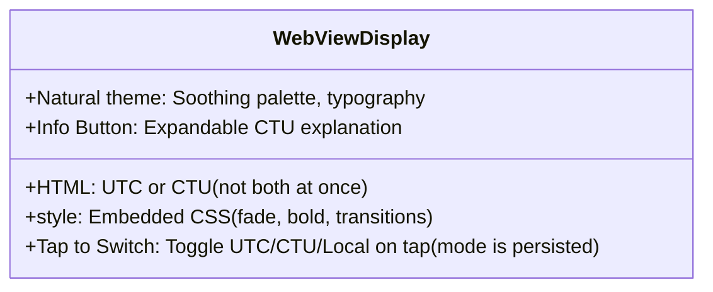
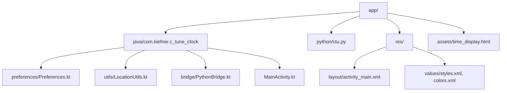
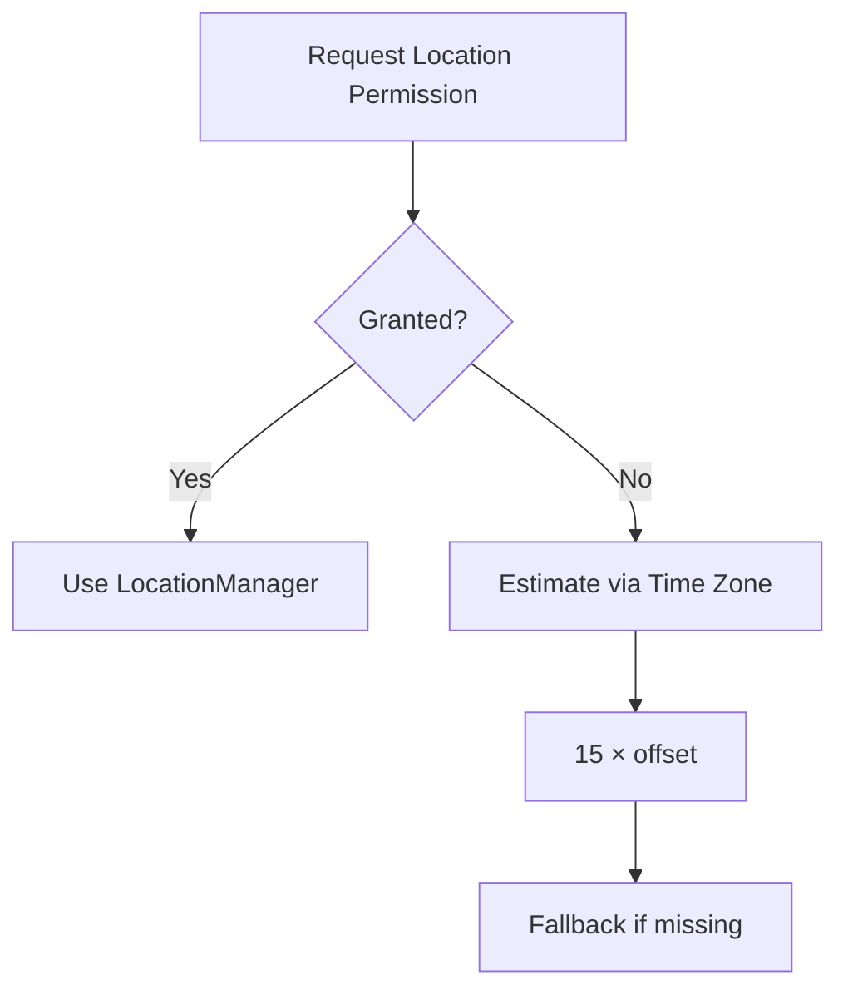
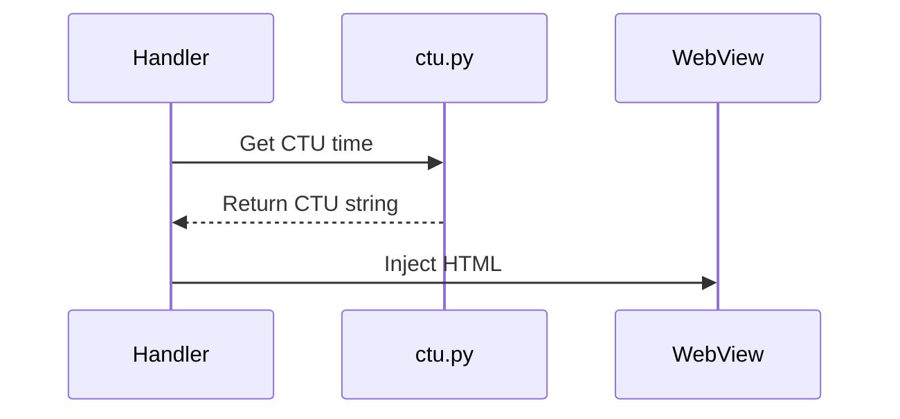
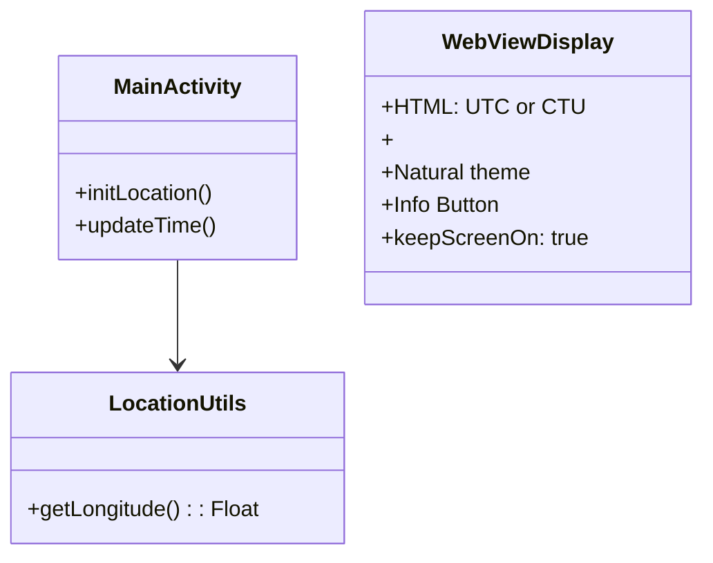

**C-Tune Clock: Android App Specification**

---

## ✨ Purpose
Real-time display of Coordinated Universal Time (UTC) **or** Calculated Time Uncoordinated (CTU) on Android. Only one is shown at a time; tap the screen to switch. CTU reflects solar noon based on longitude.

---

## 🌍 Features Overview
| Feature / Enhancement       | Description                                                      | Status       |
|----------------------------|-------------------------------------------------------------------|--------------|
| UTC/CTU/Local Toggle       | Shows UTC, CTU, or Local time; tap to switch; mode is persisted   | Implemented  |
| UTC Display                | Shows current UTC time                                            | Implemented  |
| CTU Display                | Computes CTU from device longitude                                | Implemented  |
| Local Time Display         | Shows device local time                                           | Implemented  |
| Real-Time Updates          | Updates every second                                              | Implemented  |
| WebView UI                 | HTML/CSS-based visual display                                     | Implemented  |
| Location Awareness         | Uses device longitude; fallback based on time zone offset         | Implemented  |
| Clock Mode Persistence     | Remembers last display mode (UTC/CTU/Local) across restarts       | Implemented  |
| Solar Noon/Dusk Info       | Show astronomical context (via `dawn_dusk()`)                     | Implemented   |
| InnerText DOM Updates      | Use JS to avoid full HTML reload                                  | Implemented   |
| Screen Always-On           | Keep screen on for time display                                   | Implemented  |
---

## 📊 UI Structure

- **Single Activity App**: All time info via WebView.
- **UTC format**: `HH:MM:SS`
- **CTU format**: `HH:MM:SS`
- **Date**: `YYYY-MM-DD`
- **Dawn/Dusk**: `HH:MM`
- **Device Behavior**: Uses `FLAG_KEEP_SCREEN_ON` to maintain visibility
- **Theming**: Material Design 3 with light/dark mode support
- **Primary Palette**: Green (`#81C784` light / `#66BB6A` dark)
- **Secondary Palette**: Teal (`#4DB6AC` light / `#26A69A` dark)
- **Dynamic Colors**: Placeholder-ready for Material You

---

## 🛠 Technical Summary

### 🕒 Clock Mode Persistence
- The current clock display mode (UTC, CTU, or Local) is saved to Android SharedPreferences whenever the user switches modes.
- On app startup, the last-used mode is loaded from preferences and injected into the WebView via the Android-JS bridge.
- The JavaScript UI calls `AndroidBridge.saveClockMode(mode)` to persist the mode, and receives the initial mode from Android via `setDisplayState(mode)`.
- This ensures the user's preferred display mode is restored across app restarts.

### 💻 Platform
- **Android SDK**: Min 24, Target 35
- **Kotlin**: 2.1.0
- **Chaquopy**: 16.0.0, Python 3.12

### 📚 Core Libraries
| Library | Version | Purpose |
|---|---|---|
| AndroidX Core KTX | 1.16.0 | Kotlin extensions |
| Lifecycle Runtime KTX | 2.7.0 | Lifecycle handling |
| Desugar JDK Libs | 2.0.4 | Java 17 features on old SDKs |

### 📁 File Structure


Package	|Contents|	Key Files
|---|---|---|
|preferences|	Settings/configuration|	Preferences.kt (constants)
|utils|	Reusable helpers|	LocationUtils.kt (GPS/timezone logic)
|bridge|	External integrations|	PythonBridge.kt (Chaquopy ↔ Python)


### ⚙️ Build/Integration
- Chaquopy embeds `ctu.py` for CTU computation
- Uses Gradle + `libs.versions.toml` for dependency control
- Desugaring enables modern Java features on API 24+

---

## 🔍 Time + Location Logic

### Location Handling Flow

- Longitude → CTU computed via `ctu.py`
- UTC from Android system time
- Default/fallback longitude: ~9.1829 (Korntal-Münchingen)

### Update Cycle

- Kotlin `Handler.postDelayed` updates WebView every second
- Error handling: try/except in Python, visible toast fallback for user awareness

---

## 🏠 Architecture


---

## 🌐 Onboarding Flow
```mermaid
flowchart TD
    A[Welcome Screen<br>(Branding & "Get Started")]
    B[CTU Concept Intro<br>(Visual explanation, Info button)]
    C[Location Permission Request<br>("Required for solar time" message)]
    D{Permission Granted?}
    E[Location Confirmed]
    F[Fallback Option<br>(Manual Input)]
    G[Feature Summary<br>(Explains UTC/CTU/Local toggle)]
    H[Onboarding Complete<br>("Start Clock" button)]

    A --> B
    B --> C
    C --> D
    D -- Yes --> E
    D -- No --> F
    E --> G
    F --> G
    G --> H

```

### Design Details
| Screen              | Purpose                                   |
|---------------------|--------------------------------------------|
| Welcome             | Branding & tagline                        |
| CTU Introduction    | Explain concept visually; optional Info btn |
| Location Permission | Request longitude access                  |
| Confirmation        | Show detected or default location         |
| Summary             | Reiterate benefits and start the clock    |

- **Style Guide**: Natural color palette, gentle transitions, clean typography

---

## 🚫 Error Handling
- Visible toasts for user feedback
- Logging for dev analysis
- Revisit permissions from settings link

---

## 📝 Testing & Validation
- UTC↔CTU conversion consistency
- Simulate denied permissions (fallback accuracy)
- Device compatibility, runtime permission checks

---

## 🔄 Summary
C-Tune Clock is a minimalist yet precise time app aligning UTC with solar-based CTU. Built with Kotlin + Python, and embedded WebView, it offers an intuitive interface and extensibility via modular architecture and onboard CTU logic.
