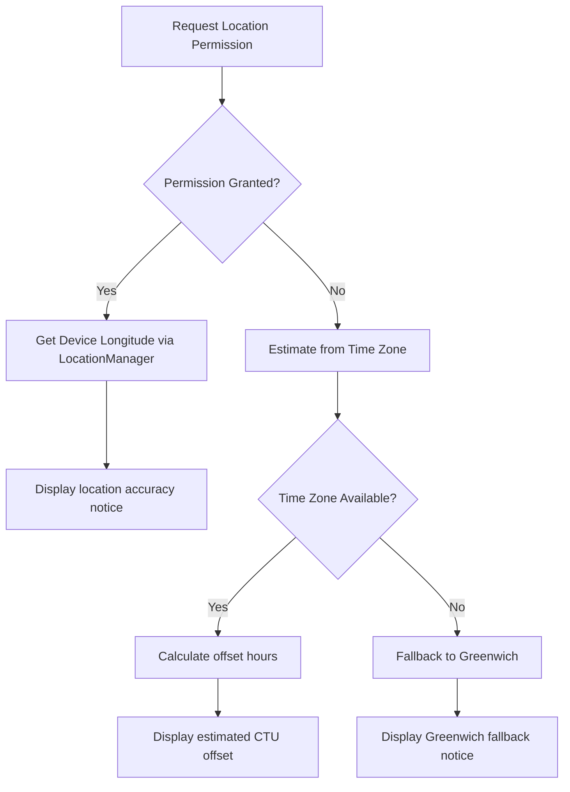
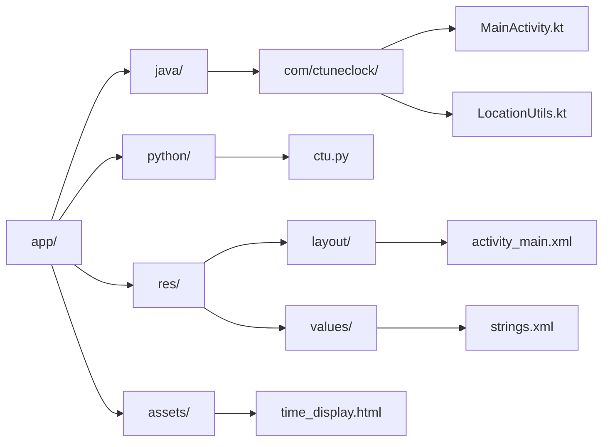
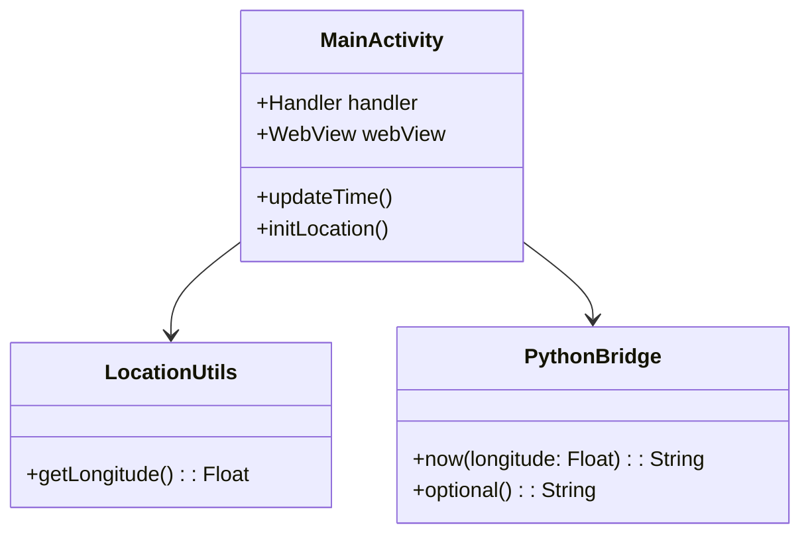
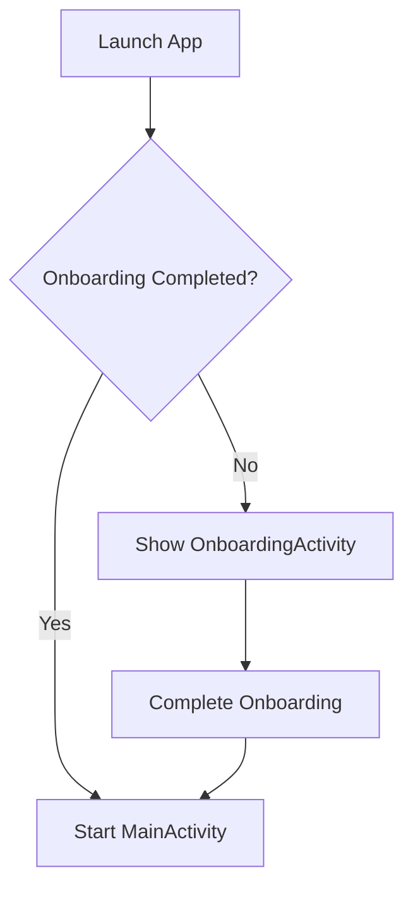
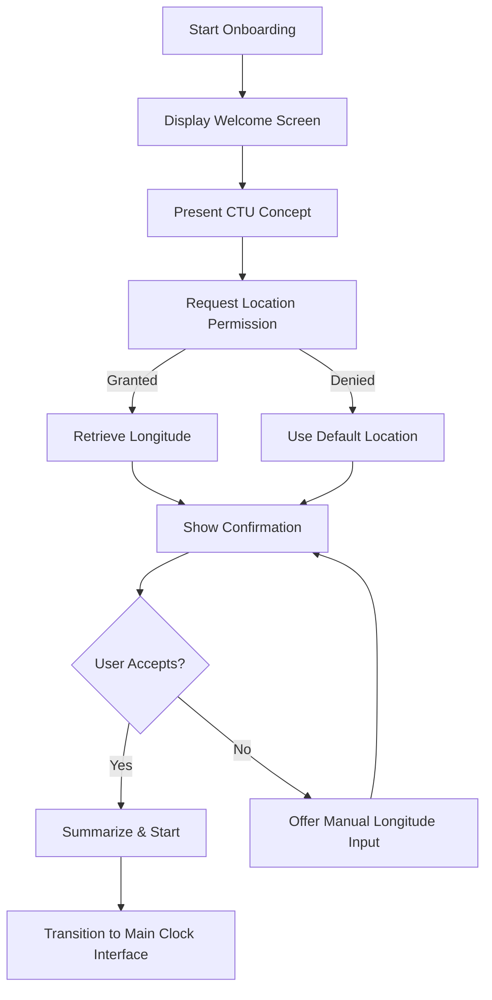

# **C-Tune Clock: Android App Specification**

## 1. **Purpose**
To provide a clear and real-time display of the current Coordinated Universal Time (UTC) and Calculated Time Uncoordinated (CTU) on an Android device. CTU is based on solar noon and aims to reflect the natural rhythm of the day without time zones or daylight saving time.

## 2. **Key Features**

- **UTC Time Display:** Shows the current UTC time.
- **CTU Time Display:** Calculates and shows the CTU time based on the device's longitude.
- **Real-Time Updates:** UTC and CTU update at a regular interval (e.g., every second).
- **HTML/CSS Rendering:** Embedded WebView renders dynamic HTML for time display.
- **Location Awareness:** Retrieves device longitude. Uses a fallback default if access is denied.

## 3. **UI**

- **Single Activity:** Only one screen in the app.
- **WebView Display:** Displays a simple, styled HTML structure containing:
  - UTC: Displayed as `YYYY-MM-DD HH:MM:SS UTC`
  - CTU: Displayed as `HH:MM:SS`
- **HTML Template:**
  - Styled using embedded `<style>` tags.
  - Simple visual layout with clear labels.
  - Optional enhancements like fade-in/out, bold/large text for emphasis.

## 4. **Technical Implementation**

#### **Platform**
* Android
* * Minimum SDK: 24 (Android 7.0 Nougat)
* * Compile & Target SDK: 35 (Android 14)
* * Android Gradle Plugin (AGP): 8.9.1
* Kotlin: Version 2.1.0
* Chaquopy (version 16.0.0) for Python integration

|Library|	Version	|Purpose
|-----------------|----------------|------------------|
|AndroidX Core KTX	|1.16.0	|Kotlin extensions for Android core
|AndroidX Lifecycle Runtime KTX	|2.7.0	|Lifecycle-aware components
|AndroidX Activity Compose	|1.9.0	|Compose integration with Activity
|Jetpack Compose BOM	|2024.04.00	|Compose platform dependencies
|Desugar JDK Libs	|2.0.4	|Java 17+ features on older devices

#### Build & Configuration
* Gradle Setup:
* * Dependencies and plugins are managed via libs.versions.toml (ensuring consistent versions across the project).
* * The app’s target API in the manifest now aligns with Gradle settings (tools:targetApi="35"), while retaining a minimum SDK of 24 for broad device compatibility.
* Native Libraries:
* * Using Chaquopy, Python modules (e.g., ctu.py) are integrated to compute CTU based on device longitude.
* * The build is configured to use core library desugaring (with desugar_jdk_libs version 2.0.4) to support new Java APIs on older Android versions.

#### **Python Integration**
* `ctu_time.py` library used via Chaquopy
* The core Python module (ctu.py) is placed under app/python.
* Chaquopy is configured in the project to use Python 3.12.

#### **Time Source**
- UTC: Retrieved using Android system time
- CTU: Computed from Python with current longitude and UTC

#### **Location Handling**
- Requests `ACCESS_FINE_LOCATION`
- If granted: uses last known longitude
- If denied or unavailable: estimate longitude from time zone:
    - longitude = 15.0 × (time zone offset in hours)
    - Example: GMT+2 ⟶ longitude ≈ 30.0

#### **Real-Time Updates**
- Kotlin `Handler` with `Runnable` updates every second
- Refreshes time and regenerates HTML
- Loads HTML into WebView each cycle (or better: update via JavaScript)

#### **Error Handling**
- Python calls wrapped in try/except
- Fallback CTU message if computation fails
- Logging to console (or visible toast for user)

## 5. **File Structure**
#### **Python Integration**
- The `ctu.py` file containing the CTU logic is included directly in the `app/python` directory. It contains the core functions: now(longitude) and dawn().

## 6. Architecture

## 7. Onboarding

### 1. Overview
The onboarding process for C-Tune Clock is crafted to gently introduce users to its distinctive blend of standard Coordinated Universal Time (UTC) and solar-aligned Calculated Time Uncoordinated (CTU). Since CTU is a novel concept for most people, the onboarding must explain it clearly and simply. The aim is to build trust and intrigue while ensuring users grant the necessary location permissions for accurate time computation.

### 2. Onboarding Objectives
- **Introduce CTU:** Explain in plain language that CTU is a natural time system aligned with solar noon, contrasting it with standard UTC. For example, use a tagline like “Time as Nature Intended” to bridge the concept.
- **Clarify the Difference:** Clearly illustrate the difference between CTU and UTC. Visual aids (diagrams/animations) can be used here to show how the solar cycle affects CTU.
- **Obtain Location Permissions:** Request access to the device's location. Convey that the longitude is essential to compute CTU accurately. Offer a fallback default if the user denies permission, ensuring that they’re aware of this choice.
- **Ensure a Smooth Transition:** Guide users step-by-step to the main clock interface so that they feel confident about using the app, with all necessary permissions and explanations clarified.

### 3. Onboarding Flow
The onboarding division into several screens or steps could look like this:

#### Welcome Screen
- **Content:** Display the app’s name (C-Tune Clock) and a tagline such as “Time as Nature Intended.”
- **Purpose:** Create an immediate, positive first impression and hint at the natural, solar-based time concept.

#### CTU Introduction Screen
- **Content:** Provide a brief explanation of CTU, contrasting it with conventional UTC.
- **Visuals:** Use simple diagrams or animations to illustrate how solar noon influences the CTU system.
- **Purpose:** Educate users without overwhelming them with technical details.

#### Location Permission Screen
- **Content:** Request for access to the device’s location with a message like: “Allow access to determine your local solar time for a precise CTU experience.”
- **Options:**
  - **Grant Permission:** If granted, the app retrieves the actual longitude.
  - **Deny/Skip:** Use the default longitude (e.g., 9.1829), and provide a brief note indicating that this setting might slightly affect the CTU accuracy.
- **Purpose:** Ensure transparency about why location data is needed and how it benefits the CTU calculation.

#### Confirmation Screen
- **Content:** Display the detected or default location and confirm the settings.
- **Options:** Optionally, offer a manual input option for users who want to specify their longitude.
- **Purpose:** Reinforce user choice and build confidence that the app is working with the correct data.

#### Summary & Start Screen
- **Content:** Recap the key features of the app and affirm that the CTU system represents a natural timekeeping method.
- **Button:** A clear call-to-action, such as “Start C-Tune Clock,” transitions users to the main interface.
- **Purpose:** Finalize the onboarding experience, ensuring the user is informed and ready to use the app.

### 4. UML Activity Diagram for Onboarding

### 7. Error Handling & Additional Considerations
- **Permission Denied Handling:** If the user denies access, explicitly display a message stating that the default location (Korntal-Münchingen) will be used. Consider adding a button or link that enables users to revisit permissions later.
- **Visual Appeal:** Use a natural, soothing color palette and typography that match the app’s theme. Consider subtle animations for smooth transitions between onboarding pages to maintain engagement.
- **Optional Depth:** Since CTU is a technical concept, provide an “Info” button on the CTU Introduction Screen for users who want to learn more in-depth details via an expandable section or additional screen.
- **Performance:** Keep the onboarding lightweight and ensure that the transition to the main clock interface is smooth, without unnecessary delays.

## **8. Testing & Validation**
* Include tests for round-trip UTC → CTU → UTC conversion accuracy
* Simulate locations and time zones to validate fallback logic
* Ensure resilience to location permission denial

## 9. **Potential Enhancements** *(Future Scope)*

- Display the **CTU reference date** under CTU
- Allow user to **manually input longitude**
- Show **solar noon time**
- Integrate **dawn/dusk** data using `dawn_dusk()`
- Enable **JavaScript innerText updates** to reduce HTML reload cost
- Implement **clock drift detection** and optional manual sync

## 10. **Summary**
C-Tune Clock is a minimal, effective app that makes use of precise astronomical timing to provide a natural sense of time. The initial scope is well-contained but flexible enough for future scientific and UX enhancements.
