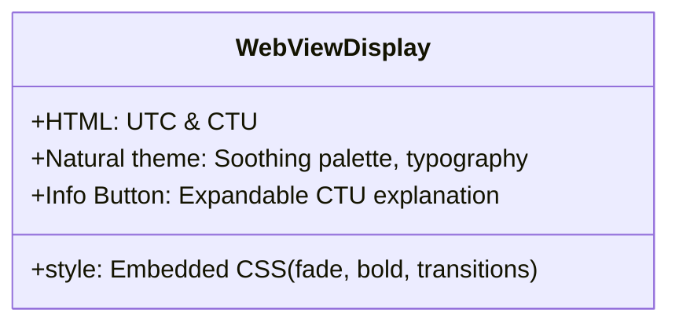
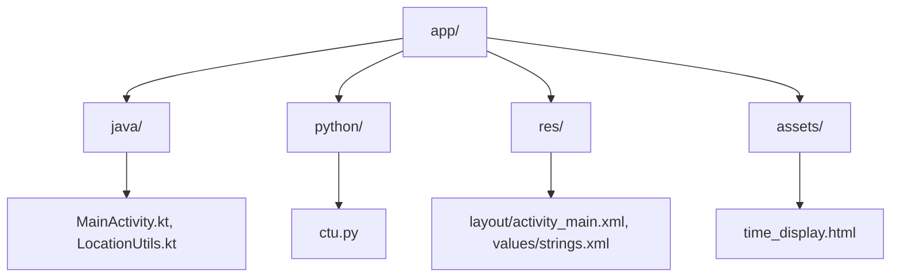
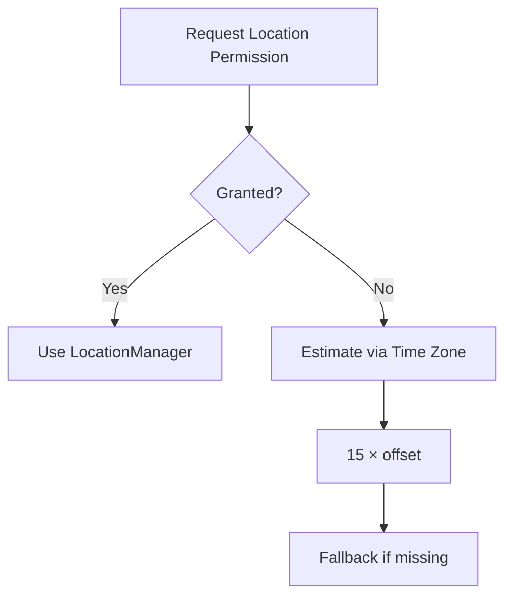
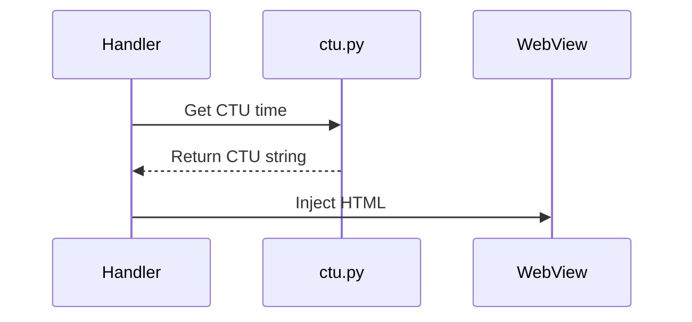
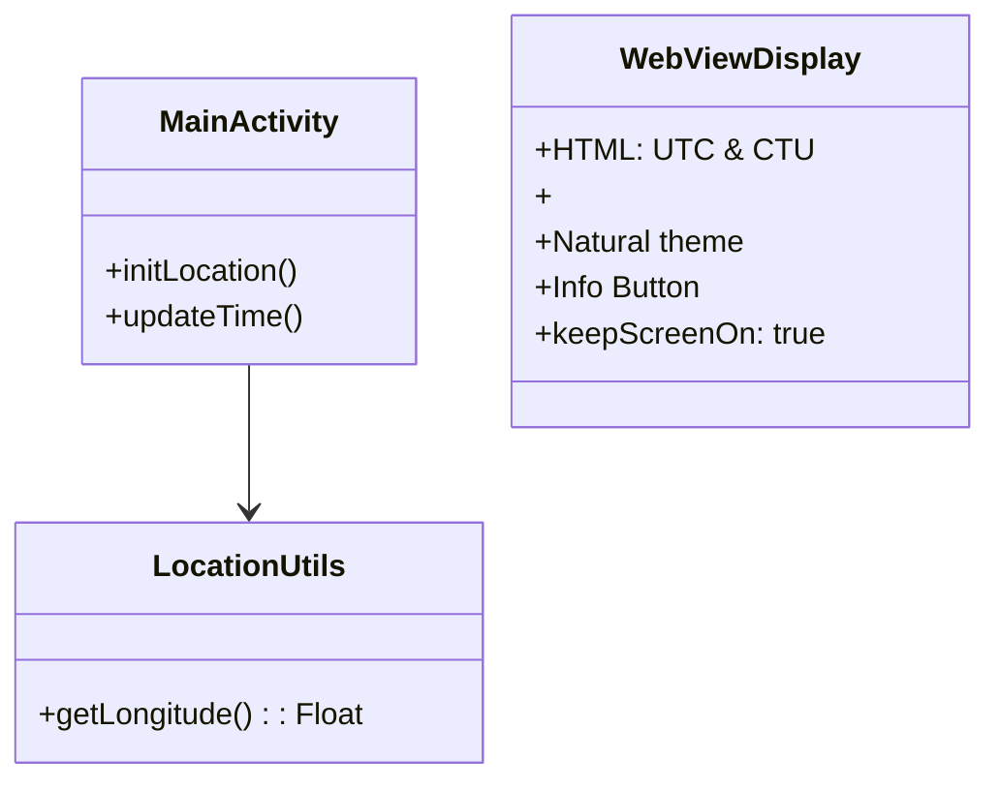
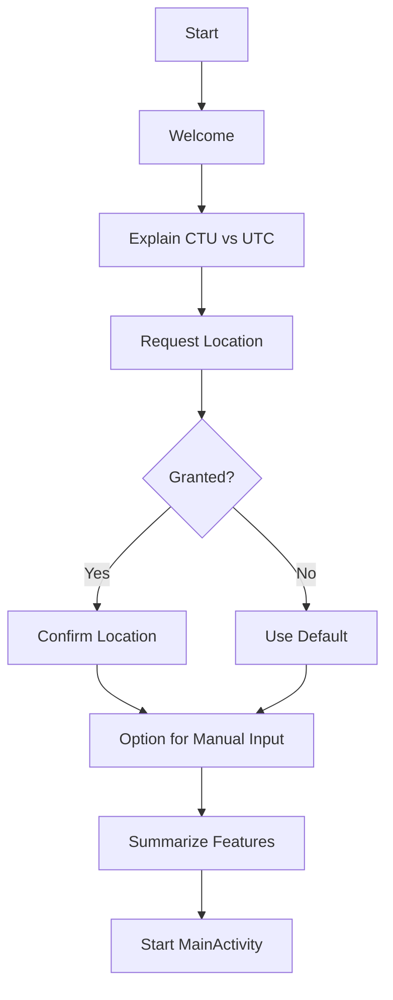

**C-Tune Clock: Android App Specification**

---

## ✨ Purpose
Real-time display of Coordinated Universal Time (UTC) and Calculated Time Uncoordinated (CTU) on Android. CTU reflects solar noon based on longitude.

---

## 🌍 Features Overview
| Feature / Enhancement       | Description                                                      | Status       |
|----------------------------|-------------------------------------------------------------------|--------------|
| UTC Display                | Shows current UTC time                                            | Implemented  |
| CTU Display                | Computes CTU from device longitude                                | Implemented  |
| Real-Time Updates          | Updates every second                                              | Implemented  |
| WebView UI                 | HTML/CSS-based visual display                                     | Implemented  |
| Location Awareness         | Uses device longitude; fallback based on time zone offset         | Implemented  |
| Reference Date             | Add CTU reference date display                                    | Planned      |
| Manual Longitude Input     | User-defined longitude entry                                      | Planned      |
| Solar Noon/Dusk Info       | Show astronomical context (via `dawn_dusk()`)                     | Planned      |
| InnerText DOM Updates      | Use JS to avoid full HTML reload                                  | Planned      |
| Clock Drift Detection      | Detect & optionally sync clock drift                              | Planned      |
|Screen Always-On| Keep screen on for time display| Implemented|
---

## 📊 UI Structure

- **Single Activity App**: All time info via WebView.
- **UTC format**: `HH:MM:SS`
- **CTU format**: `HH:MM:SS`
- **Date**: `YYYY-MM-DD`
- **Dawn/Dusk**: `HH:MM`
- **Device Behavior**: Uses `FLAG_KEEP_SCREEN_ON` to maintain visibility

---

## 🛠 Technical Summary

### 💻 Platform
- **Android SDK**: Min 24, Target 35
- **Kotlin**: 2.1.0
- **Chaquopy**: 16.0.0, Python 3.12

### 📚 Core Libraries
| Library | Version | Purpose |
|---|---|---|
| AndroidX Core KTX | 1.16.0 | Kotlin extensions |
| Lifecycle Runtime KTX | 2.7.0 | Lifecycle handling |
| Desugar JDK Libs | 2.0.4 | Java 17 features on old SDKs |

### 📁 File Structure

### ⚙️ Build/Integration
- Chaquopy embeds `ctu.py` for CTU computation
- Uses Gradle + `libs.versions.toml` for dependency control
- Desugaring enables modern Java features on API 24+

---

## 🔍 Time + Location Logic

### Location Handling Flow

- Longitude → CTU computed via `ctu.py`
- UTC from Android system time
- Default/fallback longitude: ~9.1829 (Korntal-Münchingen)

### Update Cycle

- Kotlin `Handler.postDelayed` updates WebView every second
- Error handling: try/except in Python, visible toast fallback for user awareness

---

## 🏠 Architecture

---

## 🌐 Onboarding Flow

### Design Details
| Screen              | Purpose                                   |
|---------------------|--------------------------------------------|
| Welcome             | Branding & tagline                        |
| CTU Introduction    | Explain concept visually; optional Info btn |
| Location Permission | Request longitude access                  |
| Confirmation        | Show detected or default location         |
| Summary             | Reiterate benefits and start the clock    |

- **Style Guide**: Natural color palette, gentle transitions, clean typography

---

## 🚫 Error Handling
- Visible toasts for user feedback
- Logging for dev analysis
- Revisit permissions from settings link

---

## 📝 Testing & Validation
- UTC↔CTU conversion consistency
- Simulate denied permissions (fallback accuracy)
- Device compatibility, runtime permission checks

---

## 🔄 Summary
C-Tune Clock is a minimalist yet precise time app aligning UTC with solar-based CTU. Built with Kotlin + Python, and embedded WebView, it offers an intuitive interface and extensibility via modular architecture and onboard CTU logic.
